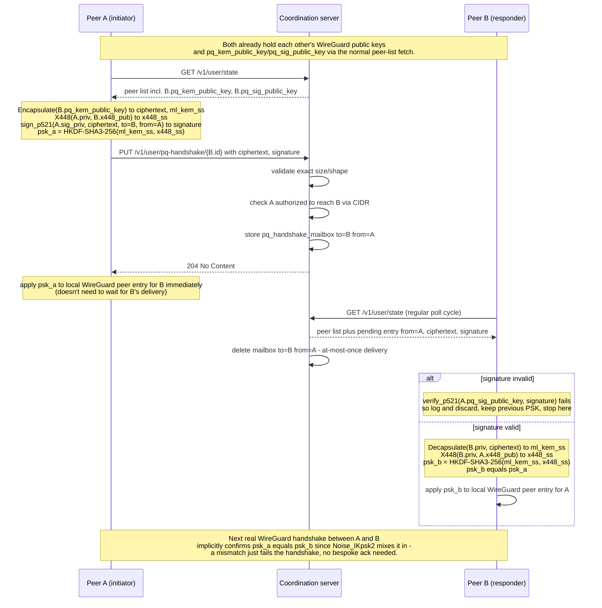

# Design: Post-quantum WireGuard via peer-to-peer ML-KEM exchange

Status: draft
Related: [milestones.md](milestones.md)

## 1. Motivation

innernet peers connect over WireGuard, whose handshake authenticates and
derives keys using classical elliptic-curve Diffie–Hellman. That is not
post-quantum secure: traffic recorded today could be decrypted later by an
adversary with a cryptographically relevant quantum computer ("harvest now,
decrypt later").

This doc proposes hardening every WireGuard link against that threat by
periodically deriving a **preshared key (PSK)** from a genuine post-quantum
key encapsulation mechanism (KEM), and feeding it into WireGuard exactly the
way any operator-supplied PSK works today. This does not replace the
WireGuard handshake — it strengthens it: WireGuard's `Noise_IKpsk2` pattern
mixes the PSK into the final session key, so the combination is
cryptographically no less secure than WireGuard on its own, and enabling it
can only help.

The distinguishing design choice here is **how** the two sides of a link
exchange the KEM material: directly, peer-to-peer, using the *existing*
coordination-server channel every peer already talks to for peer discovery —
not a new, separately-exposed network service. The server's role stays
exactly what it already is for WireGuard public keys and endpoints: a
directory peers push to and pull from. It never sees a private key or a
derived secret, only opaque ciphertext blobs (and their signatures, §5.8) it
relays.

This document describes the architecture, protocol, and data model only —
it is implementation-language-independent, since no code exists yet.

## 2. Background: ML-KEM and why a relay, not a listener

- **ML-KEM** (FIPS 203, standardized 2024, formerly known as Kyber) is a
  NIST-standardized post-quantum KEM. A KEM has three operations: `KeyGen()`
  → `(public_key, secret_key)`; `Encapsulate(public_key)` → `(ciphertext,
  shared_secret)`; `Decapsulate(secret_key, ciphertext)` → `shared_secret`
  (the same value the encapsulating side produced). Critically, this is a
  **one-shot** operation, not an interactive multi-round-trip protocol — the
  encapsulating side needs nothing from the other side except its long-lived
  public key, which it can fetch once and cache.
- This design uses **ML-KEM-1024**, the highest of the standardized
  parameter sets (NIST Category 5, roughly AES-256-equivalent classical
  security). Its sizes are still small enough to travel as ordinary API
  payloads: public key 1568 bytes, ciphertext 1568 bytes, comfortably under
  two kilobytes base64-encoded. This is the key enabling fact for this
  design: it means the public key can be *just another field* on a peer's
  existing record, and a ciphertext can be *just another small object* the
  coordination server temporarily stores and forwards — no separate
  listener, no separate wire protocol, no new exposed port.
- Because encapsulation is one-shot and asynchronous (the encapsulating side
  doesn't need the other side to be online at that exact instant — it just
  needs the recipient's public key, which is already cached), the natural
  transport for the ciphertext is the *same* request/response channel a peer
  already uses to fetch its peer list: drop the ciphertext off, the recipient
  picks it up on its next regular poll.
- This deliberately avoids running any new always-on network service per
  peer. Every additional exposed listener is additional attack surface (an
  unauthenticated flood against it, a parser bug in a new wire format, a
  port an operator has to remember to firewall) — see §6 for why this
  matters more than it might first appear.

### 2.1 Cryptographic building blocks

- **KEM and hybrid ECDH: leancrypto.** A single library providing
  ML-KEM-1024, X448, and SHA3/HKDF, rather than pulling in a separate
  implementation per primitive. Its integration maturity for whichever
  implementation this design is eventually built in is a tracked risk
  (§10), not assumed away.
- **KDF: HKDF-SHA3-256** (§5.7) for combining the hybrid shared secret into
  the final 32-byte WireGuard PSK. SHA3 (Keccak) is a structurally different
  hash family from SHA2, which this design prefers for the same
  hedge-against-a-single-family reasoning already applied to the KEM/curve
  choices — a future weakness specific to the SHA2 family wouldn't affect
  this KDF.
- **Hybrid classical DH: X448** (§5.7), via leancrypto. Curve448 (the
  "Goldilocks curve") pairs a large classical security margin with
  ML-KEM-1024's higher PQ security category.
- **Signature scheme for §5.8's ciphertext authentication: NIST P-521**
  (secp521r1) with ECDSA — a **separate** dependency from leancrypto, since
  leancrypto does not implement NIST prime-field curves. This means the
  design depends on two independent cryptographic libraries rather than
  one — an explicit, tracked tradeoff (§10), accepted here because P-521 is
  a FIPS 186-5-approved NIST curve, which matters for deployments with
  FIPS-approved-primitive requirements.
- **Storage: SQLite**, already used to hold the peer directory (§3), gains
  two new nullable fields and one new small table (§5.1). No new storage
  system is introduced.
- **Linking: against system-provided installations, not vendored/bundled
  copies.** Both the KEM/hybrid-ECDH library and SQLite are linked against
  the versions already installed on the host, so a deployment declares them
  as ordinary runtime dependencies rather than statically bundling private
  copies — consistent with how this project's non-minimal-footprint
  packaging already declares its runtime dependencies explicitly.

## 3. Relevant existing innernet architecture

(For readers unfamiliar with the system; skip to §5 if not.)

- **Coordination server, not a data-plane relay.** The server holds a
  SQLite-backed peer directory — each peer's WireGuard public key, IP,
  CIDR membership, and endpoint. It never carries actual VPN traffic; peers
  fetch each other's info and then talk to each other directly over
  WireGuard. This design keeps that property: the mailbox described below
  stores tiny ciphertext blobs, never tunnel traffic.
- **Peer visibility already follows CIDR scoping.** A peer only ever learns
  about the peers it's authorized to see, enforced server-side per existing
  CIDR/authorization rules. Any new per-peer field added to the peer record
  inherits this scoping for free — nothing new to re-implement.
- **The bulk state fetch.** Clients periodically fetch their current peer
  list from the server (on a configurable interval, default 60 seconds) and
  apply it to the local WireGuard interface. The server also runs its own
  equivalent sync loop for its own coordination-API WireGuard link (see
  §5.10). This existing poll loop is the natural place to also pick up and
  process pending KEM material — no new polling loop needs to be invented.
- **PSK application is already a solved, separate concern.** Applying a PSK
  to a running WireGuard interface is already a small, non-disruptive
  operation in this system — the existing WireGuard-control layer merges
  peer settings onto the existing peer rather than tearing down the tunnel.
  Nothing about this design changes that mechanism; it only changes how the
  PSK value gets derived.
- **Feature flags and backward compatibility.** The server already has a
  mechanism for advertising optional features to clients, and peer record
  fields already default gracefully when absent, so old and new
  client/server combinations interoperate without a hard cutover. The
  schema changes below follow that exact pattern.

## 4. Non-goals

- Not building general-purpose NAT traversal for the exchange — it reuses
  the coordination server's already-authenticated channel, which every peer
  already reaches by construction (it has to, to get its peer list at all).
- Not attempting to hide metadata (who is exchanging keys with whom) from
  the coordination server — it already knows the full peer graph and CIDR
  membership; this adds nothing new to that trust boundary.
- Not building a general pub/sub or messaging system. The mailbox is
  intentionally narrow: one pending ciphertext (plus its signature) per
  ordered peer pair, with a short TTL — not a general delivery mechanism
  for arbitrary payloads.
- Not supporting non-Linux platforms for this feature (see §5.13) — even
  though other parts of this project run on macOS/OpenBSD.

## 5. Proposed design

### 5.1 Data model & schema changes

- Add two nullable fields to the peer record and its backing storage: a
  KEM public key and a signature public key, mirroring how the existing
  WireGuard public key field already works. The signature public key is
  used to verify a peer's ciphertext signatures (§5.8).
- Both fields default to absent when serialized, so old and new
  client/server combinations round-trip peer records without them.
- Add one boolean feature flag advertising this capability, following the
  existing pattern for advertising optional server features.
- New table, a handshake mailbox: `(to_peer_id, from_peer_id, ciphertext,
  signature, created_at)`, primary-keyed on `(to_peer_id, from_peer_id)` —
  at most one pending, undelivered ciphertext per ordered pair at a time. A
  fresh encapsulation overwrites any previous undelivered one for that pair
  rather than accumulating a backlog.

### 5.2 New server endpoints

- `PUT /v1/user/pq-handshake/{to_peer_id}` — upload a ciphertext (and its
  signature, §5.8) addressed to another peer. Validates: `ciphertext`
  matches the expected ML-KEM-1024 ciphertext length exactly (1568 bytes)
  and `signature` matches the expected P-521 ECDSA signature length exactly
  (reject anything else outright, same spirit as the existing
  candidate-endpoint size caps), `to_peer_id` must be a peer the caller is
  authorized to see (same CIDR check already applied to peer-list
  visibility).
- Delivery needs no separate `GET` endpoint: pending ciphertexts addressed
  to the requester are embedded directly in the existing bulk peer-state
  fetch response (one extra optional field per peer entry the fetcher is
  authorized to see). The server deletes a mailbox row once served in a
  response — at-most-once delivery, no separate ack round trip.
- A short TTL (a small multiple of the fetch interval — e.g. 10 minutes)
  garbage-collects anything nobody ever picked up, so the table can't grow
  unbounded from peers that are offline or have since been removed.

### 5.3 Client: keypair lifecycle

- Generate an ML-KEM-1024 keypair, a dedicated X448 keypair (§5.7), and a
  dedicated P-521 signing keypair (§5.8) once per interface, at the same
  point the interface's WireGuard keypair is first established. Store all
  three secret keys with the same permission discipline (owner-only) as
  the existing WireGuard private key.
- Register all three public keys with the server through the same
  mechanism already used to register other per-peer fields, called once at
  setup and re-checked idempotently (only sent if it doesn't already match
  what the server has on record) on every regular sync.
- The client's status display should show whether the local interface and
  each visible peer has advertised PQ public keys.

### 5.4 Dial/listen tie-break for exchange initiation

Exactly one side of every peer pair must be the one to encapsulate first
(the "initiator" for that pair) — if both sides encapsulated independently
and applied their own locally-computed secret, they'd derive **two
different** values and the tunnel would silently fail to agree on a PSK,
with no visible error. Both sides need to reach the same
initiator/responder assignment without coordinating, so it's derived from
something both already know: peer ID.

- The coordinating server is always peer id 1 (the first peer any network
  has). It's special-cased to always be the **responder**, never the
  initiator: it's the side an operator can reliably keep online 24/7, while
  any other peer may be offline, asleep, or behind a NAT with no stable
  reachability — none of which matters here, since initiation only requires
  the *coordination server* to be reachable (which every peer already
  assumes), not the other peer directly.
- For a pair where neither side is the server, there's no such asymmetry to
  exploit, so it falls back to an arbitrary but deterministic tie-break: the
  lower peer ID initiates.

### 5.5 Peer-to-peer exchange protocol

Per ordered pair `(initiator, responder)` decided by §5.4 (see §8 for the
full sequence diagram):

1. The initiator fetches the responder's KEM public key and signature
   public key (already present in its regular peer-list fetch — no extra
   round trip).
2. The initiator calls `Encapsulate(responder_kem_public_key)` locally,
   getting `(ciphertext, ml_kem_shared_secret)`, and separately performs an
   X448 ECDH against the responder's X448 public key, getting
   `x448_shared_secret` (§5.7).
3. The initiator signs `ciphertext || to_peer_id || from_peer_id` with its
   own P-521 ECDSA private key (§5.8), producing `signature`.
4. The initiator uploads `{ciphertext, signature}` via
   `PUT /v1/user/pq-handshake/{responder_id}`. Neither shared secret nor any
   secret key ever leaves the initiator's machine.
5. On the responder's next regular state fetch, the pending
   `{from_peer_id, ciphertext, signature}` for this pair is included in the
   response. The responder first verifies `signature` against the
   initiator's cached signature public key — an invalid signature is
   discarded and logged, and processing stops there for that entry (§5.8),
   leaving the previously-applied PSK untouched.
6. On a valid signature, the responder calls
   `Decapsulate(own_kem_secret_key, ciphertext)`, recovering
   `ml_kem_shared_secret`, and performs its own X448 ECDH against the
   initiator's public key, recovering the identical `x448_shared_secret`.
7. Both sides independently derive the final 32-byte PSK via
   HKDF-SHA3-256 (§5.7) from the same two shared secrets, and apply it to
   that specific peer's WireGuard configuration — exactly as any other PSK
   update already works in this system. The initiator can apply its half
   immediately after step 2 without waiting for delivery; the responder
   applies once it completes step 6/7 on its next poll — see §5.6 for why
   this timing gap is harmless.

### 5.6 Rotation cadence & confirmation

- **Default rotation interval: 5 minutes**, independently configurable via
  a `--pq-psk-rotation-interval <seconds>` option on both the client and
  the server — deliberately not silently tied to the general peer-list
  fetch interval, since an operator may reasonably want a different
  cadence for the two.
- **Confirmation reuses WireGuard's own handshake, rather than building a
  bespoke acknowledgment protocol.** After applying a newly-derived PSK,
  nothing needs to explicitly verify the two sides agree — if they don't,
  WireGuard's own `Noise_IKpsk2` handshake (which mixes the PSK in) simply
  fails to complete for that peer, exactly like an outright key mismatch
  today. On failure, keep the previous working PSK in place until the next
  rotation succeeds, rather than clearing it — the same "never leave a link
  with no PSK at all due to a single failed cycle" principle applied
  everywhere else PSKs are handled in this system. This is also what makes
  the initiator/responder application-timing gap in §5.5 harmless: worst
  case, a WireGuard handshake attempt in that narrow window fails and
  retries once the responder catches up.

### 5.7 Hybrid classical+PQ secret combiner

Relying on a single post-quantum algorithm family means a future
cryptanalytic break of that one algorithm compromises every derived PSK.
Standard practice in modern hybrid key-exchange designs is to combine an
ML-KEM shared secret with an independent classical ECDH shared secret via a
KDF, so the result stays secure as long as *either* half remains unbroken:

- Generate a dedicated X448 keypair per interface alongside the ML-KEM
  one (not the WireGuard static key itself — keeping these separate avoids
  any cross-protocol key-reuse concerns).
- Perform an ordinary X448 ECDH alongside the ML-KEM encapsulation in the
  same round described in §5.5.
- `psk = HKDF-SHA3-256(ikm = ml_kem_shared_secret || x448_shared_secret,
  info = "innernet pq-psk v1", length = 32)`.

### 5.8 Signed-ciphertext hardening (P-521 / ECDSA)

The coordination server relays the ciphertext but cannot read the shared
secret it encapsulates — it only ever handles opaque bytes. However, since
the server is also the source of truth for a peer's advertised KEM public
key, a compromised server could in principle substitute its own keypair
when asked "what is peer B's public key," letting it decrypt what it
thinks is peer A's message to B (a relay-level MITM). This is **the same
trust boundary the coordination server already has** for WireGuard public
key distribution — a compromised server can already substitute a
WireGuard public key and MITM the classical handshake today, so this
doesn't newly expand what a compromised server can do, only extends an
already-accepted trust assumption to one more field.

This design closes that specific gap with a concrete mechanism: each side
signs its ciphertext (and the ordered peer-pair identifiers, binding the
signature to exactly that exchange) with a dedicated **P-521 (ECDSA)**
identity key, distinct from its WireGuard, ML-KEM, and X448 keys (§5.3).
Signatures use a fixed-width raw `r || s` encoding (each 66 bytes, 132
bytes total) rather than variable-length DER, so the mailbox endpoint's
exact-length validation (§5.2) stays simple and deterministic. The
receiving side verifies the signature against the sender's already-cached
signature public key before ever decapsulating — an invalid signature
means either a corrupted delivery or a substituted/forged message, and is
discarded without touching the existing PSK (§5.5 step 5). P-521 was
chosen for its large security margin and FIPS 186-5 approval, matching
this design's general preference for higher-margin primitives given how
new the overall construction is — accepting a second crypto dependency
(§2.1) as the cost.

Whether this ships as part of the default, always-on baseline or as an
additional opt-in hardening flag remains an open question — see §10.

### 5.9 Mailbox lifecycle & cleanup

- At most one undelivered ciphertext per ordered pair (§5.1) bounds storage
  regardless of how many rotation cycles are missed.
- Delete-on-delivery (§5.2) means a healthy, regularly-polling fleet never
  accumulates backlog at all.
- The TTL-based sweep (§5.2) bounds storage from peers that go permanently
  offline or get removed before ever polling again.

### 5.10 Server as a mesh peer

The coordination server is itself a WireGuard peer (its own coordination-API
link), and participates in this scheme exactly like any other peer: it
generates its own ML-KEM/X448/P-521 keypairs, advertises its public keys
via its own peer record, and runs the same periodic sync task client
interfaces run, applying the resulting PSK to its own device — no
special-casing beyond the responder role already assigned to it in §5.4.

### 5.11 Permissive mode & mixed-fleet interop

Not every peer will have this enabled — a phone running a stock WireGuard
client, for instance, has no PQ public keys to advertise at all. This is
handled the same way any other opt-in per-peer capability is in this
system: a peer that enables PQ hardening (`--enable-pq-psk`, say) can
additionally opt into `--pq-psk-permissive`, which falls back to a plain
WireGuard connection (no PSK) for any peer that hasn't advertised a KEM
public key, instead of treating it as unreachable. This is always a
per-operator, client-side choice — the server isn't in the data path and
can't force a peer to run this locally, only tell peers about each other.

### 5.12 Independent per-peer state, by construction

Because each peer pair's PSK is derived from a standalone, independent
KEM exchange — not a shared multi-peer process with one combined
configuration file — pausing, skipping, or backing off the rotation cadence
for one specific idle peer has **no effect on any other peer's exchange**.
This falls out of the architecture rather than needing to be specially
engineered: there is no shared daemon to restart, no combined config file
to regenerate, and no reason a per-peer idle-detection policy would ever
need to touch any other peer's state.

**Idle-detection policy:** rotation for a specific peer pauses after
**15 minutes** with no observed WireGuard traffic for that peer (checked via
transfer byte-count deltas across polls, the same signal already available
from the WireGuard interface's own transfer statistics), independently
configurable via a `--pq-psk-idle-timeout <seconds>` option. Resumption is
eager: the very next poll that observes fresh traffic for that peer
immediately resumes normal rotation for that pair specifically, rather than
waiting for a fixed re-check interval or affecting any other peer.

### 5.13 Build targets & platform support

This feature targets **Linux only**, on the same two architectures this
project already ships prebuilt binaries for: **x86_64 (amd64)** and
**aarch64**. No macOS, OpenBSD, or Windows support is planned for this
feature even though other parts of this project run there — the chosen
cryptographic libraries' own primary platform support and this project's
existing release tooling already center on Linux, and extending either to
another OS is out of scope here.

## 6. Security considerations

- **No new exposed listener.** Every exchange happens over the same
  request/response channel already used for peer discovery, authenticated
  the same way (existing peer-key-based auth on the coordination API). There
  is no new UDP (or any other) port for an operator to open, firewall, or
  rate-limit, and therefore no new standalone flood/amplification/DoS
  surface distinct from what the coordination API already has to defend
  against.
- **Forward secrecy is a function of rotation cadence.** Each rotation
  produces an independent secret from a fresh encapsulation; compromising
  one derived PSK doesn't expose any other rotation's value (ML-KEM
  ciphertexts don't reveal the secret key, and each encapsulation is
  independently randomized).
- **Replay.** A captured, replayed ciphertext just re-derives the exact same
  secret the original exchange already produced — not a new one — so replay
  by itself doesn't help an attacker who doesn't already have the
  corresponding secret key. The mailbox's delete-on-delivery semantics
  additionally mean a legitimate replay opportunity (re-delivering the same
  ciphertext twice) shouldn't normally arise at all.
- **Forgery/substitution** of a relayed message is addressed directly by the
  §5.8 P-521/ECDSA signature — a responder never processes a ciphertext it
  can't verify came from the claimed sender.
- **Server-compromise blast radius** is bounded to what §5.8 already
  describes: without the signed-ciphertext hardening enabled, a compromised
  server can MITM the relay, matching its existing ability to MITM
  WireGuard peer identity distribution — not a new category of exposure
  introduced by this design. With it enabled, that specific MITM path is
  closed, since the server cannot forge a valid P-521 signature on either
  peer's behalf.
- **Input validation on the mailbox endpoint** must reject anything that
  isn't exactly a well-formed ML-KEM-1024-ciphertext-and-P-521-signature-sized
  payload outright, the same discipline already applied to the existing
  candidate-endpoint validation, so a malformed upload can't be used to
  probe for parser bugs or store oversized garbage.

## 7. Test plan: Docker-based security testing

Mirrors this project's existing convention of testing against real,
end-to-end processes in Docker containers rather than relying solely on
unit tests with fakes — prior integration work on this project caught
multiple real bugs (permission handling, timing, config-generation edge
cases) this way that pure unit testing missed, and there is no reason to
expect a from-scratch PQ implementation to be any less bug-prone.

### 7.1 Topology

- One coordination-server container.
- At least four peer containers on the same isolated Docker network, no
  external egress required:
  - `peer-a`, `peer-b` — two normal, cooperating peers, used for the
    happy-path, rotation, and idle-detection tests.
  - `peer-m` — an adversarial peer with valid credentials for its own
    identity but no authorization to see `peer-b` (different CIDR), used
    for cross-tenant isolation tests.
  - `peer-x` — a peer used only for flood/DoS testing against the mailbox
    endpoint, kept separate so its behavior can't contaminate the other
    peers' results.

### 7.2 Test cases

1. **Baseline convergence.** `peer-a` and `peer-b` complete one exchange;
   assert both sides' independently-derived PSK bytes are identical
   (compared via a debug-only dump the test harness reads, never exposed in
   production).
2. **PSK actually reaches WireGuard.** Assert the applied preshared-key
   value on both containers reflects the newly-derived value, not the
   interim/previous one.
3. **Rotation over time.** Run past two rotation intervals (using a
   shortened rotation-interval setting for test speed); assert the applied
   PSK value changes between rotations.
4. **Cross-CIDR mailbox isolation.** `peer-m` attempts
   `PUT /v1/user/pq-handshake/{peer-b-id}`; assert the server rejects it
   (matching the existing CIDR-authorization behavior for peer-list
   visibility) and `peer-b` never sees a mailbox entry from `peer-m`.
5. **Malformed payload rejection.** `peer-m` uploads a payload of the wrong
   length/shape; assert 4xx, and assert the server process is still alive
   and responsive afterward (no panic).
6. **Invalid signature rejection.** Tamper with a captured, legitimately
   ML-KEM-1024-sized ciphertext's signature before delivery; assert the
   responder logs a verification failure and does **not** apply the
   resulting PSK, leaving the previous one in place.
7. **Replay is harmless.** Re-deliver an already-consumed (mailbox row
   already deleted) ciphertext by re-uploading the same bytes; assert this
   never produces a *different* PSK than the original exchange already did.
8. **TTL sweep.** Upload a ciphertext addressed to a peer container that's
   paused (simulating an offline peer) past the TTL; assert the mailbox row
   is gone afterward and never gets delivered once the peer resumes
   polling.
9. **Idle-detection pause/resume.** Stop generating WireGuard traffic
   between `peer-a` and `peer-b` past the idle threshold (shortened via the
   idle-timeout setting for test speed); assert rotation pauses for that
   pair specifically, and assert `peer-a`'s *other* peer relationships keep
   rotating normally on schedule (directly exercises the §5.12 independence
   claim). Resume traffic; assert rotation resumes without manual
   intervention.
10. **Mailbox flood resilience.** `peer-x` floods
    `PUT /v1/user/pq-handshake/*` at a high rate; assert `peer-a`/`peer-b`'s
    own exchanges are unaffected (server stays responsive, no shared
    resource exhaustion) and the server process doesn't crash.
11. **Permissive/mixed-fleet fallback.** A peer with no registered PQ public
    keys at all; assert an enabled peer with permissive mode falls back to
    a plain WireGuard connection, and without that mode treats it as
    unreachable.

### 7.3 Acceptance

All eleven cases automated and passing in CI, specifically including the
security-negative cases (4–8, 10) — a green suite that only covers the
happy path is not sufficient to close out the security-review milestone.

## 8. Sequence diagram: full exchange, data flow, and API endpoints

Data exchanged at each hop, for reference:

| Step | Endpoint | Payload | Approx. size |
|---|---|---|---|
| A fetches B's keys | `GET /v1/user/state` | existing peer list + `pq_kem_public_key` (1568 B, ML-KEM-1024), `pq_sig_public_key` (~67 B, P-521 compressed) per peer | existing response + ~1.6 KB/peer |
| A uploads ciphertext | `PUT /v1/user/pq-handshake/{B.id}` | `ciphertext` (1568 B, ML-KEM-1024) + `signature` (132 B, P-521 raw r‖s) | ~1.7 KB |
| B fetches pending entry | `GET /v1/user/state` | existing response + one `{from_peer_id, ciphertext, signature}` object, only when a delivery is pending | +~1.7 KB, intermittent |

## 9. Alternatives considered

- **A dedicated always-on companion process with its own listening port**,
  running an independent PQ key-exchange protocol over the network directly
  between peers. Rejected as the default approach here specifically because
  it reintroduces exactly the operational costs this design avoids: a new
  exposed port per listening peer to firewall/rate-limit, a new standalone
  DoS surface, and — because such a daemon typically holds one combined
  config file for all of its peers rather than independent per-pair state —
  a change to any single peer's configuration typically forces a full
  process restart affecting every other peer's session simultaneously.
- **A large-public-key, code-based KEM** (multi-hundred-kilobyte to
  megabyte-scale public keys) as an additional hedge alongside a
  lattice-based KEM. Rejected for the default design: a key that large
  can't reasonably travel as an ordinary API field the way ML-KEM's ~1.6 KB
  key can, which is precisely the property this design depends on to avoid
  a separate distribution mechanism. The classical+ML-KEM hybrid in §5.7
  provides an algorithm-family hedge without that size cost.
- **A fully local, hash-ratcheted PSK schedule** (seed once via a trusted
  out-of-band channel, e.g. in person or via QR code, then have both sides
  independently derive every subsequent rotation via a one-way KDF, never
  transmitting new key material over the network again). Genuinely
  post-quantum secure in principle — a hash-based ratchet doesn't rely on
  a KEM at all — but rejected as the default: it has no way to
  automatically provision a newly-invited peer (there's no network-based
  bootstrap step at all, by design), and any missed rotation on either side
  permanently desynchronizes the two chains with no recovery mechanism
  short of re-seeding out-of-band again. Not a fit for a system built
  around automatic, network-driven peer provisioning.
- **A smaller-margin classical/PQ parameter selection** (a lower ML-KEM
  category paired with a smaller classical curve for the hybrid combiner
  and signing). Rejected in favor of pairing the highest ML-KEM category
  with higher-margin classical primitives throughout, at a modest
  additional size cost that's still well within what an ordinary API
  field/mailbox row can hold.
- **Keeping signing inside the single cryptographic library** used for the
  KEM and hybrid ECDH, rather than adding a second dependency. Rejected:
  P-521's FIPS 186-5 approval (relevant to deployments with compliance
  requirements) was judged worth the cost of a second crypto dependency
  (§2.1/§10).

## 10. Open questions / risks

- Whether the §5.6/§5.12 chosen defaults (5-minute rotation, 15-minute idle
  threshold) hold up under real fleet testing, or need tuning — the
  *values* are now decided and independently configurable, but not yet
  validated against a real deployment's traffic patterns.
- Whether the §5.8 P-521 signed-ciphertext hardening ships as part of the
  default, always-on baseline, or as an additional opt-in flag — the
  *mechanism and algorithm* are now decided, but its default-on/opt-in
  status is not.
- The chosen KEM/hybrid-ECDH library's integration maturity is not yet
  established — track this as a risk through the earliest implementation
  milestone, including whether to pin an exact version or vendor a fixed
  copy rather than tracking an upstream moving target.
- This design now depends on **two** independent cryptographic libraries
  (one for ML-KEM/X448/SHA3-HKDF, one for the P-521 signing scheme) rather
  than one. Worth revisiting during the security review whether that's an
  acceptable increase in audited-dependency surface for one primitive,
  versus a single-library alternative (§9).
- Mailbox table growth under a large, mostly-online fleet with a short
  rotation interval — the TTL sweep bounds worst case, but the concrete
  interval/TTL defaults should be chosen with real fleet sizes in mind
  before this ships.
